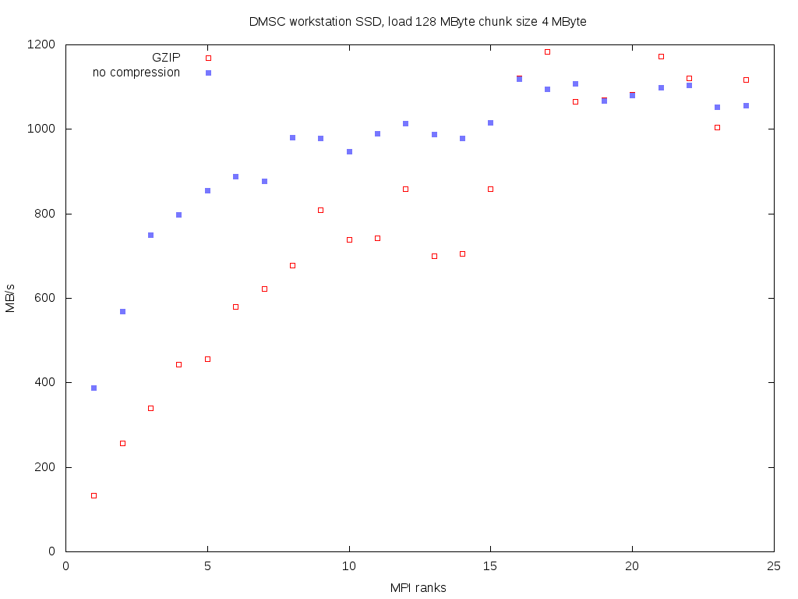

# Notes

## VISION file

- Chunking is 2048 (element size is 4 Byte) with no compression.
- Reads are extremely slow from HDD or Lustre (reading `event_id` for bank 28, data on HDD):
  ```sh
  $ ./src/load_parallel /mnt/extra/simon/neutron-data/VIS_20118.nxs.h5
  355.519954 bandwidth 16.380862 MB/s size 6106616384
  ```
  Maybe chunks are not ordered and we suffer from slow seeks?
- Repacking the file shows that this problem is not inherent to the chunk _size_:
  ```sh
  $ h5repack -i VIS_20118.nxs.h5 -o VIS_20118-chunk-1M.nxs.h5 -l CHUNK=1048576
  $ h5repack -i VIS_20118.nxs.h5 -o VIS_20118-chunk-2048.nxs.h5 -l CHUNK=2048
  $ ./src/load_parallel /mnt/extra/simon/neutron-data/VIS_20118-chunk-1M.nxs.h5
  39.358613 bandwidth 147.965662 MB/s size 6106616384
  $ ./src/load_parallel /mnt/extra/simon/neutron-data/VIS_20118-chunk-2048.nxs.h5
  44.310634 bandwidth 131.429471 MB/s size 6106616384
  ```

This indeed points to a seeking issue due to unordered chunks.
Unordered chunks can be expected if chunks for many banks are added constantly to the file during a run.

As to be expected and confirmed by Tobias Richter: if chunk size is large enough, the ordering issue and the resulting seeks should become irrelevant.

**TODO: Get test file from DM to verify this expectation.**

## SSD

Loading from several processes does give a speedup for test files on a DMSC workstation SSD (*not* real files creates from a stream).
Test files have been creates by the helper script `scripts/create_file.py`.
Obtained around 1 GByte/s.



See [MPI](#mpi) for discussion.

## MPI

Loading from several processes does give a speedup for test files (*not* real files creates from a stream).
Obtained 600-700 MByte/s with Lustre.


For few MPI ranks the slow GZIP decompression has a big negative effect on performance.
With increasing number of used cores the relative difference decreases as expected/hoped.

**Conclusion: Given these results with the expected improvement of GZIP with many cores the envisioned loader model with many processes makes sense. As a next step we need to prove that the GZIP compression does not take too much CPU so it does not affect the follow-up stages of loading files.**

No compression:
```sh
$ file=/mnt/lustre/users/simon/stripe-test/num-element=33554432_chunk=1048576_compress=None.hdf5
$ for i in $(seq 1 12); do /users/simon/software/vmtouch/vmtouch -e $file > /dev/null; echo -n "$i " ; /usr/mpi/intel/openmpi-1.4.3-qlc/bin/mpiexec -n $i ./src/load_parallel $file; done
1 0.602958 bandwidth 212.286628 MB/s size 134217728
2 0.344880 bandwidth 371.143919 MB/s size 134217728
3 0.297719 bandwidth 429.935691 MB/s size 134217728
4 0.225663 bandwidth 567.216938 MB/s size 134217728
5 0.168411 bandwidth 760.045370 MB/s size 134217728
6 0.165332 bandwidth 774.198692 MB/s size 134217728
7 0.178504 bandwidth 717.071300 MB/s size 134217728
8 0.171551 bandwidth 746.133881 MB/s size 134217728
9 0.150122 bandwidth 852.637291 MB/s size 134217728
10 0.172729 bandwidth 741.045444 MB/s size 134217728
11 0.189289 bandwidth 676.213737 MB/s size 134217728
12 0.186752 bandwidth 685.402255 MB/s size 134217728
```

GZIP:
```sh
$ file=/mnt/lustre/users/simon/stripe-test/num-element=33554432_chunk=1048576_compress=gzip.hdf5
$ for i in $(seq 1 12); do /users/simon/software/vmtouch/vmtouch -e $file > /dev/null; echo -n "$i " ; /usr/mpi/intel/openmpi-1.4.3-qlc/bin/mpiexec -n $i ./src/load_parallel $file; done
1 1.353684 bandwidth 94.556792 MB/s size 134217728
2 0.739181 bandwidth 173.164733 MB/s size 134217728
3 0.663640 bandwidth 192.875541 MB/s size 134217728
4 0.479785 bandwidth 266.786169 MB/s size 134217728
5 0.328861 bandwidth 389.222703 MB/s size 134217728
6 0.286930 bandwidth 446.101580 MB/s size 134217728
7 0.305338 bandwidth 419.207675 MB/s size 134217728
8 0.231502 bandwidth 552.911618 MB/s size 134217728
9 0.219579 bandwidth 582.933429 MB/s size 134217728
10 0.213643 bandwidth 599.130415 MB/s size 134217728
11 0.207330 bandwidth 617.373687 MB/s size 134217728
12 0.207408 bandwidth 617.139663 MB/s size 134217728
```

## Lustre

Lustre on the DMSC cluster has a default stripe count of 1.
Performance seems to be getting much better if we increase this, to the maximum in this case:

```sh
$ lfs setstripe -s 1M -i 0 -c -1 stripe-test
$ lfs getstripe stripe-test
stripe-test/
stripe_count:   -1 stripe_size:    1048576 stripe_offset:  0
stripe-test//num-element=33554432_chunk=1048576_compress=None.hdf5
lmm_stripe_count:   4
lmm_stripe_size:    1048576
lmm_layout_gen:     0
lmm_stripe_offset:  0
        obdidx           objid          objid            group
             0         7114011       0x6c8d1b                0
             1         7203564       0x6deaec                0
             2         7122220       0x6cad2c                0
             3         7055189       0x6ba755                0
```

## vmtouch

Helper for flushing files from disk cache.
This is an alternative to
```sh
# echo 3 > /proc/sys/vm/drop_caches
```
if root rights are not available.

```sh
git clone https://github.com/hoytech/vmtouch
cd vmtouch
make
./vmtouch -e filename
```

Caveats:
- Does not seem to work with large files due to memory allocation issue.
  This seems to indicate that the tool simply allocates a lot of memory to push files out of the cache?
